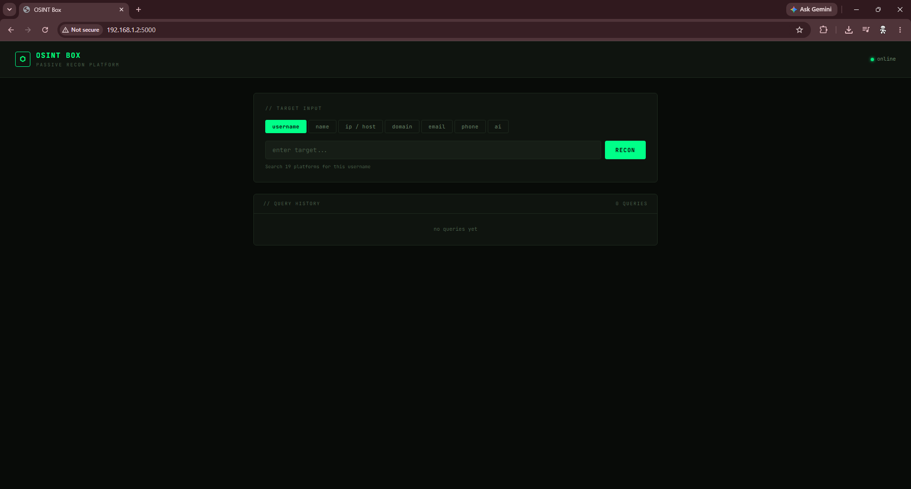

# >\_ OSINTBox

> A modular OSINT reconnaissance toolkit. Run from your own machine. No third-party APIs required.



---

## What it does

OSINTBox is a self-hosted OSINT platform with six recon modules, a dark terminal UI, and local SQLite storage. Everything runs on your machine — no data leaves your device.

| Module           | What it does                                        |
| ---------------- | ---------------------------------------------------- |
| Username Search  | Find accounts across 19 platforms by username         |
| Name Search      | Username variations + Google dork links from a name   |
| IP / Host Lookup | Resolve IPs, reverse DNS, geolocation                  |
| Domain Recon     | WHOIS, DNS records, subdomains via crt.sh              |
| Email Analysis   | Format validation, MX lookup, Gravatar check           |
| Phone Parsing    | Country/format detection, Truecaller/Sync.me links     |

Username and name results render as a recon dashboard: a target identity card with status
pills, a platform-by-platform table with site icons, a summary stats grid, and donut charts
breaking down hit rate and platform category (dev / social / other).

Every query is logged to a local SQLite history you can revisit later.

### Optional: AI analysis (Groq)

Add a Groq API key and two more features unlock:

- **AI tab** — describe a target in plain English and it parses out usernames/emails/IPs/etc. to search automatically.
- **ANALYZE button** — turns any result into a written dossier with suggested next targets to chain into.

Without a key, the rest of the app works exactly the same — these two features just stay hidden.

---

## Installation

**Requirements:** Python 3.10+

```bash
git clone https://github.com/cookiesn1ffer/osintbox.git
cd osintbox
python -m venv venv
venv\Scripts\activate      # Windows
source venv/bin/activate   # Linux
pip install flask
python app.py
```

Open http://localhost:5000 in your browser.

To enable AI features, create a `.env` file next to `app.py`:

```
GROQ_API_KEY=your_key_here
```

Get a free key at https://console.groq.com/keys.

---

## Raspberry Pi deployment

`setup.sh` automates a permanent install on a Raspberry Pi (built for/tested on a Pi Zero WH):

```bash
git clone https://github.com/cookiesn1ffer/osintbox.git
cd osintbox
bash setup.sh
```

It installs system dependencies (`whois`, `dnsutils`), creates a Python venv, optionally prompts for a Groq API key, and installs + starts an `osintbox` systemd service that auto-restarts on crash and on boot. Re-running it is safe — it picks up code/dependency changes and won't re-prompt for a key you've already set.

Once running, visit `http://<pi-ip>:5000`.

Useful commands:

```bash
sudo systemctl status osintbox     # check it's running
sudo journalctl -u osintbox -f     # tail logs
sudo systemctl restart osintbox    # apply changes after a git pull
```

---

## Stack

- **Flask** — lightweight web server
- **SQLite** — local query history
- **Python** — all recon modules pure Python, no heavy dependencies

---

## License

Copyright (c) 2026 Aarush (cookiesn1ffer). All rights reserved.
This software is proprietary. See LICENSE for details.
